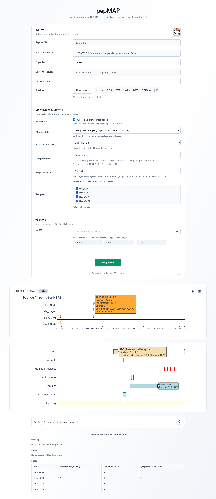

# pepMAP

pepMAP is a web-based application for visualizing peptide mappings onto protein sequences. It supports input from FragPipe, DIA-NN, MaxQuant, and Spectronaut reports, providing an interactive interface to explore peptide coverage and protein features.



## Features

- **Support for DIA-NN, FragPipe, MaxQuant, and Spectronaut Inputs**: Upload peptide reports to visualize peptide mappings on proteins.

- **Interactive Visualization**: Explore peptide coverage with an intuitive interface powered by Plotly.

- **Protein Feature Integration**: Fetch and display protein domains, binding sites, modified residues, and variants from UniProt.

- **Multi-User Sessions**: Supports multiple users simultaneously with isolated sessions.

- **Custom Features Upload**: Accepts custom features either with the initial upload or in a later step.

- **API Access**: Provides endpoint for uploading data and plotting.

- **Peptide Summary Tables**: Generate summary tables of peptide coverage per sample, topology, or domain.

- **Sample Selection + Regex Cleanup**: Select a subset of samples and optionally clean sample names with a regex.

## Installation

To run pepMAP locally, follow these steps:

### 1. Clone the Repository

```bash
git clone https://github.com/npinter/pepMAP.git
cd pepMAP
```

### 2. Create a Conda Environment

Create the Conda environment from the included `environment.yaml`:

```bash
conda env create -f environment.yaml
conda activate pepMAP
```

### 3. Run the Application

Activate the Conda environment and start the Flask application:

```bash
conda activate pepMAP
(pepMAP) python app.py
```

By default, the application runs on `http://localhost:7007`. Open this URL in your web browser to access pepMAP.

## Usage

1. **Upload Files**: Upload your peptide report and FASTA file used in the search.
```
DIA-NN: report.tsv/.parquet
FragPipe: psm.tsv
MaxQuant: evidence.txt
Spectronaut: report.tsv

FASTA: db.fasta
```
2. **Search Proteins**: Enter a UniProt ID or gene symbol to visualize peptide mappings.

3. **Custom Features Format**: Use a tab-separated file with the columns `uniprot`, `position`, `description`, `literature`. The `position` field can be a single number or a range.

Example (`custom_features.tsv`):

```tsv
uniprot position    description literature
P04626  1242-1254   IHC (Ventana 4B5)   https://doi.org/10.1111/j.1365-2559.2011.04034.x
P04626  557-603 ADC (Trastuzumab/Herceptin) https://doi.org/10.1038/nature01392
Q9NZQ7  284-290 IHC (Ventana SP263) https://doi.org/10.1038/s41379-019-0372-z
```

4. **API Usage (Upload + Plotting)**: The API supports file uploads with an optional `session_id`, and plotting endpoints accept the same settings as the UI (proteotypic, charge states, q-value (EP) cutoff, sample name cleanup, summary table mode, and optional sample selection via `selected_runs`). The browser UI creates a session on upload, while external tools can supply their own. Session IDs must be 8-128 characters and match `[A-Za-z0-9_-]`.

**Endpoints**

- `POST /upload` (multipart): `report_file`, `fasta_file`, `organism` (`HUMAN`/`MOUSE`/`CUSTOM` + `custom_organism`), optional `custom_features_file` + `custom_features_label`, optional `session_id` to reuse, and optional plot defaults: `proteotypic_checkbox` (`true`/`false`), `charge_state_mode` (`all`/`unique`), `q_value_cutoff` (0-0.05), `sample_name_cleanup` (`none`/`split_underscore`/`custom`), `sample_name_custom_pattern` (regex; capture group 1 used if present), `summary_mode` (`per_sample`/`per_topology`/`per_domain`).
- `POST /plot_peptides` and `POST /plot_features` (multipart): require `search_input` (gene symbols and/or UniProt IDs separated by spaces/commas/semicolons), accept optional `search_labels` (JSON array of custom names aligned with `search_input`), and support the same settings plus optional `selected_runs` (JSON array of sample names).

Example (external upload + plotting with `curl`):

```bash
# upload report + fasta and optional custom features, get or reuse a session_id
curl -X POST http://127.0.0.1:7007/upload \
  -F session_id=my_session_001 \
  -F report_file=@report.tsv \
  -F fasta_file=@db.fasta \
  -F organism=HUMAN \
  -F custom_features_file=@custom_features.tsv \
  -F custom_features_label="IHC Panel" \
  -F proteotypic_checkbox=true \
  -F charge_state_mode=unique \
  -F q_value_cutoff=0.01 \
  -F sample_name_cleanup=custom \
  -F sample_name_custom_pattern='^([^_]+)' \
  -F summary_mode=per_topology

# plot one or more genes/proteins and optionally set custom display names
curl -X POST http://127.0.0.1:7007/plot_peptides \
  -F session_id=my_session_001 \
  -F search_input='TP53 EGFR' \
  -F search_labels='["p53 custom","EGFR custom"]' \
  -F selected_runs='["Sample_A","Sample_B"]'
```

## License

This project is licensed under the MIT License.


# Note

- Ensure that you have an active internet connection, as the application fetches protein features from the UniProt API.
- The application stores uploaded data in `storage/` and schedules daily deletion to manage server resources effectively.
